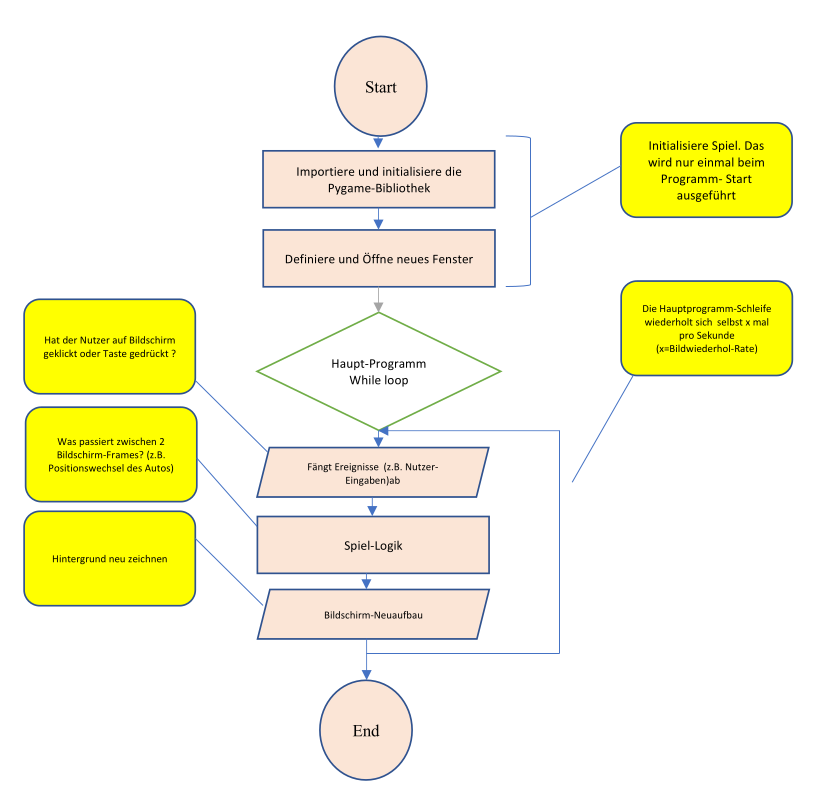
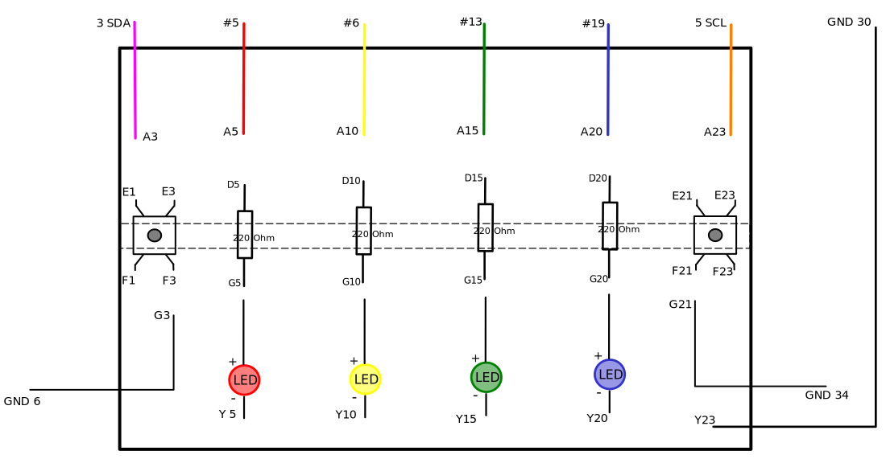

# Simple game on RasPi 
## Tutorium python und RasPi

### Ziel:

Das Ziel dieses Projektes ist die Implementierung eines simplen Spiels mit 
der Möglichkeit, dieses mit dem selbstentworfenen Spieljoystick zu spielen!
*(Zu jedem Schritt gibt es ein Ordner mit dem Code siehe oben!)*

### Schritt 1 - Spiel:

Zuerst wird der Quellcode des Spiels zusammen mit Teilnehmern erstellt, dabei ist es
von der Bedeutung die verwendete Spiellogik kennenzulernen. 

Das folgende Flussdiagramm stellt die Struktur, anhand deren das Spiel geschrieben
wird.

Bibliotheken:
- pygame
- random

### Schritt 2 - Joystick:

Als nächstens wird ein einfaches Spieljoystick auf dem Steckbrett aufgebaut
und anschließend dazu ein Paar Übungsprogrammen geschrieben. (z.B. Blinking) 

Bibliotheken:
- gpiozero

**Hinweis**: kompilieren mit '$ python3 filename.py' 

### Schritt 3 - Joystick in das Spiel integrieren:

Abschließend wird der Joystick (aus dem Schritt 2) in dem Spiel benutzt, um
die Eingabe vom Spieler, zu ermöglichen.
